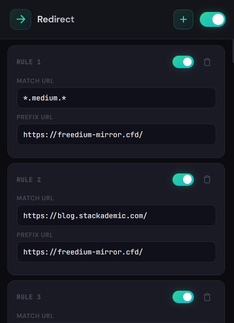

# Redirect (Chrome extension)

Redirect is a Manifest V3 browser extension that automatically redirects matching URLs by **prepending a configurable prefix URL**.

It ships with sensible defaults for Medium-family sites and uses `https://freedium-mirror.cfd/` as the default prefix, but everything is configurable from the popup UI.

## Features

- **Rule-based redirects**: each rule has a `Prefix URL` and multiple `Match URLs`
- **Wildcards**: use `*` in `Match URLs` (example: `*.medium.*`)
- **Per-rule enable/disable** toggles
- **Global enable/disable** toggle
- **Sync across browsers** (uses `chrome.storage.sync`)

## Install (unpacked)

1. Open `chrome://extensions` (or `edge://extensions`)
2. Enable **Developer mode**
3. Click **Load unpacked**
4. Select this folder (the one containing `manifest.json`)

## Use

1. Click the extension icon to open the popup
2. Add a rule (`+`)
3. Set:
   - **Prefix URL**: what to prepend to the current URL
   - **Match URLs**: add one or more patterns to match (supports `*` wildcard)
4. Toggle rules on/off as needed

When you navigate to a matching page, the extension redirects the tab to:

`<prefixUrl><originalUrl>`

Example:

- Match: `https://towardsdatascience.com/`
- Prefix: `https://freedium-mirror.cfd/`
- Result: `https://freedium-mirror.cfd/https://towardsdatascience.com/...`

## How matching works

- The extension listens to top-frame navigations (`chrome.webNavigation.onBeforeNavigate`).
- `Match URLs` are converted to regular expressions where `*` becomes `.*`.
- Redirect loops are prevented by skipping redirects when the current URL already starts with the rule’s prefix.

## Permissions

- `storage`: save your settings
- `webNavigation`: detect navigations early enough to redirect
- `tabs`: update the current tab URL
- `host_permissions: <all_urls>`: allows redirecting any site you create a rule for

## Project layout

- `manifest.json`: extension manifest (MV3)
- `background.js`: service worker; performs redirects
- `popup.html` / `popup.css` / `popup.js`: settings UI
- `icons/`: extension icons

## Notes

- Settings are stored under the `freecfd` key in `chrome.storage.sync`.
- If you want different defaults, edit `DEFAULT_MATCH_PATTERNS` / `DEFAULT_SETTINGS` in `background.js` and `popup.js`.
